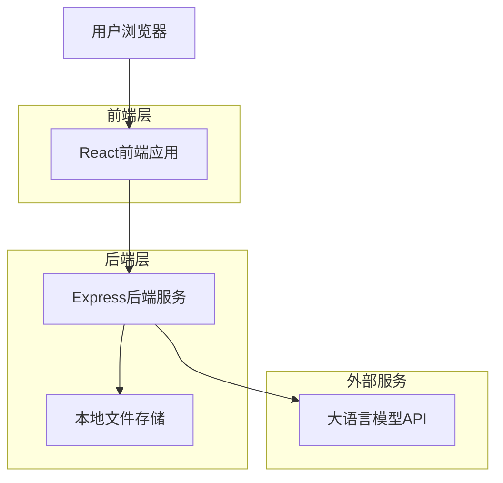
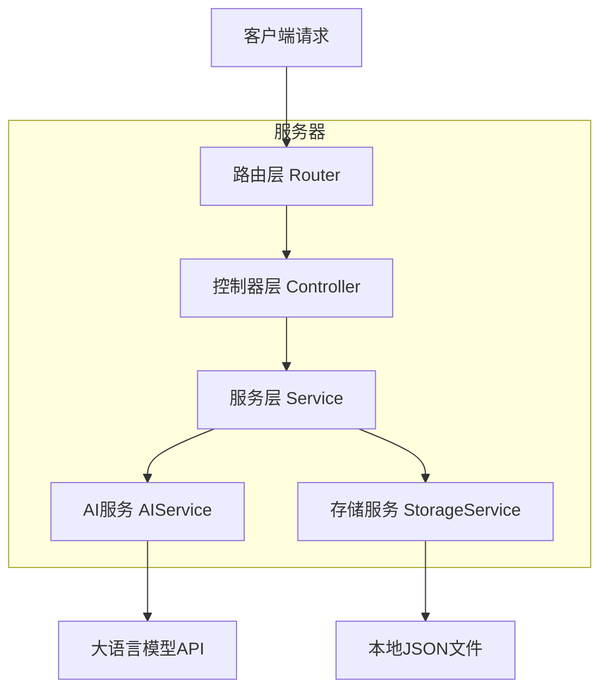
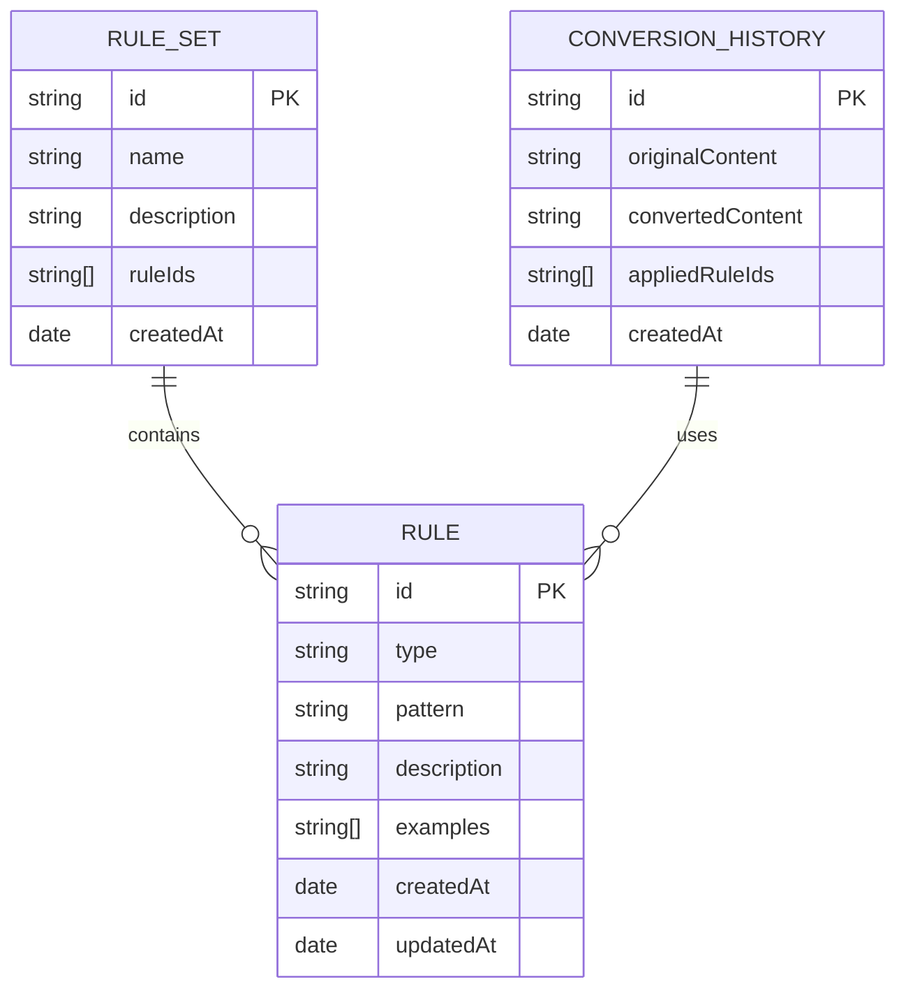

# Markdown自动排版智能体技术架构文档

## 1. 架构设计



## 2. 技术描述

* **前端**: React\@18 + TypeScript + Tailwind CSS + Vite

* **后端**: Express\@4 + TypeScript + Node.js

* **存储**: 本地JSON文件存储

* **AI服务**: OpenAI GPT-4 API（可配置其他LLM）

## 3. 路由定义

| 路由       | 用途                   |
| -------- | -------------------- |
| /        | 首页，展示产品介绍和功能导航       |
| /extract | 样式提取页面，上传文本并提取语法规则   |
| /convert | 样式转换页面，应用规则转换文本样式    |
| /rules   | 规则管理页面，查看和管理已保存的语法规则 |

## 4. API定义

### 4.1 核心API

**样式提取API**

```
POST /api/extract
```

请求参数:

| 参数名          | 参数类型      | 是否必需  | 描述                |
| ------------ | --------- | ----- | ----------------- |
| content      | string    | true  | 需要分析的Markdown文本内容 |
| extractTypes | string\[] | false | 指定要提取的样式类型        |

响应参数:

| 参数名     | 参数类型    | 描述         |
| ------- | ------- | ---------- |
| success | boolean | 请求是否成功     |
| rules   | Rule\[] | 提取到的语法规则数组 |
| message | string  | 响应消息       |

示例请求:

```json
{
  "content": "# 标题\n**加粗文本**\n*斜体文本*\n> 引用文本",
  "extractTypes": ["heading", "bold", "italic", "quote"]
}
```

示例响应:

```json
{
  "success": true,
  "rules": [
    {
      "id": "rule_1",
      "type": "heading",
      "pattern": "# {text}",
      "description": "一级标题",
      "examples": ["# 标题"]
    },
    {
      "id": "rule_2", 
      "type": "bold",
      "pattern": "**{text}**",
      "description": "加粗文本",
      "examples": ["**加粗文本**"]
    }
  ],
  "message": "成功提取语法规则"
}
```

**样式转换API**

```
POST /api/convert
```

请求参数:

| 参数名         | 参数类型      | 是否必需  | 描述         |
| ----------- | --------- | ----- | ---------- |
| content     | string    | true  | 需要转换的文本内容  |
| ruleIds     | string\[] | true  | 要应用的规则ID数组 |
| targetStyle | string    | false | 目标样式风格     |

响应参数:

| 参数名              | 参数类型      | 描述             |
| ---------------- | --------- | -------------- |
| success          | boolean   | 转换是否成功         |
| convertedContent | string    | 转换后的Markdown内容 |
| appliedRules     | string\[] | 实际应用的规则ID      |
| message          | string    | 响应消息           |

**规则管理API**

```
GET /api/rules
POST /api/rules
PUT /api/rules/:id
DELETE /api/rules/:id
```

### 4.2 大模型提示词设计

**样式提取提示词模板:**

```
你是一个Markdown语法专家。请分析以下Markdown文本，提取出其中使用的各种样式对应的语法规则。

分析文本：
{content}

请按照以下格式返回JSON结果：
{
  "rules": [
    {
      "type": "样式类型（如heading、bold、italic等）",
      "pattern": "语法模式（用{text}表示文本内容）",
      "description": "样式描述",
      "examples": ["具体示例"]
    }
  ]
}

需要识别的样式类型包括但不限于：
- heading（标题）
- bold（加粗）
- italic（斜体）
- quote（引用）
- code（代码）
- link（链接）
- list（列表）
- table（表格）
```

**样式转换提示词模板:**

```
你是一个Markdown格式转换专家。请根据提供的语法规则，将以下文本转换为对应的Markdown格式。

原始文本：
{content}

应用的语法规则：
{rules}

转换要求：
1. 保持文本的原始含义和结构
2. 根据规则将相应的文本片段转换为Markdown语法
3. 确保转换后的格式正确且美观
4. 如果文本中已有Markdown语法，请保持或优化

请直接返回转换后的Markdown文本，不需要额外说明。
```

## 5. 服务器架构图



## 6. 数据模型

### 6.1 数据模型定义



### 6.2 数据定义

**规则数据结构 (rules.json)**

```json
{
  "rules": [
    {
      "id": "rule_heading_1",
      "type": "heading",
      "pattern": "# {text}",
      "description": "一级标题",
      "examples": ["# 主标题", "# 章节标题"],
      "createdAt": "2024-01-01T00:00:00Z",
      "updatedAt": "2024-01-01T00:00:00Z"
    },
    {
      "id": "rule_bold_1",
      "type": "bold",
      "pattern": "**{text}**",
      "description": "加粗文本",
      "examples": ["**重要内容**", "**强调文字**"],
      "createdAt": "2024-01-01T00:00:00Z",
      "updatedAt": "2024-01-01T00:00:00Z"
    }
  ]
}
```

**规则集数据结构 (rule-sets.json)**

```json
{
  "ruleSets": [
    {
      "id": "set_basic",
      "name": "基础语法规则",
      "description": "包含标题、加粗、斜体等基础语法",
      "ruleIds": ["rule_heading_1", "rule_bold_1", "rule_italic_1"],
      "createdAt": "2024-01-01T00:00:00Z"
    }
  ]
}
```

**转换历史数据结构 (conversion-history.json)**

```json
{
  "history": [
    {
      "id": "conv_1",
      "originalContent": "这是一个标题\n这是加粗文本",
      "convertedContent": "# 这是一个标题\n**这是加粗文本**",
      "appliedRuleIds": ["rule_heading_1", "rule_bold_1"],
      "createdAt": "2024-01-01T00:00:00Z"
    }
  ]
}
```

