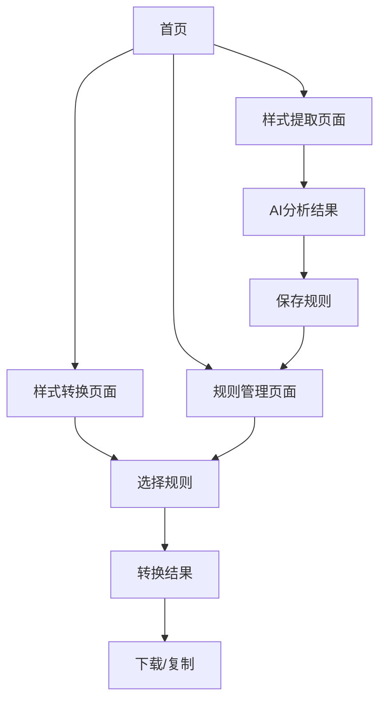

# Markdown自动排版智能体产品需求文档

## 1. 产品概述

本产品是一个基于大语言模型的Markdown自动排版智能体，帮助用户学习和应用Markdown语法规则。通过智能提取和转换功能，用户可以快速掌握各种Markdown样式的语法格式。

产品解决的核心问题：用户难以记忆和正确使用各种Markdown语法，需要一个智能工具来学习和应用这些语法规则。

## 2. 核心功能

### 2.1 用户角色
本产品无需用户角色区分，所有功能对所有用户开放。

### 2.2 功能模块

我们的Markdown自动排版智能体包含以下主要页面：
1. **首页**：功能导航、产品介绍、快速开始指引
2. **样式提取页面**：上传Markdown文本、AI分析结果展示、语法规则库管理
3. **样式转换页面**：文本输入、规则选择、转换结果展示
4. **规则管理页面**：已提取规则查看、编辑、删除、导入导出

### 2.3 页面详情

| 页面名称 | 模块名称 | 功能描述 |
|----------|----------|----------|
| 首页 | 导航区域 | 显示产品Logo、主要功能入口按钮、使用说明 |
| 首页 | 介绍区域 | 产品功能介绍、使用流程说明、示例展示 |
| 样式提取页面 | 文件上传区 | 支持拖拽上传Markdown文件或粘贴文本内容 |
| 样式提取页面 | AI分析区 | 调用大语言模型分析文本，提取各种样式的语法规则 |
| 样式提取页面 | 结果展示区 | 以表格形式展示提取的样式类型和对应语法，支持预览效果 |
| 样式提取页面 | 规则保存区 | 将提取的规则保存到本地存储，支持命名和分类 |
| 样式转换页面 | 文本输入区 | 支持粘贴或输入需要转换的Markdown文本 |
| 样式转换页面 | 规则选择区 | 从已保存的规则库中选择要应用的语法规则 |
| 样式转换页面 | 转换处理区 | 调用大语言模型根据选定规则转换文本样式 |
| 样式转换页面 | 结果展示区 | 显示转换后的Markdown文本，支持复制和下载 |
| 规则管理页面 | 规则列表区 | 展示所有已保存的语法规则，支持搜索和筛选 |
| 规则管理页面 | 编辑功能区 | 支持手动编辑、删除规则，批量操作 |
| 规则管理页面 | 导入导出区 | 支持规则的JSON格式导入导出，便于分享和备份 |

## 3. 核心流程

**样式提取流程：**
用户上传包含各种样式的Markdown文本 → AI分析文本内容 → 识别并提取各种样式对应的语法规则 → 展示提取结果 → 用户确认并保存规则到本地

**样式转换流程：**
用户输入需要转换的文本 → 选择已保存的语法规则 → AI根据规则转换文本样式 → 展示转换结果 → 用户复制或下载结果

## 4. 用户界面设计

### 4.1 设计风格

- **主色调**：#2563eb（蓝色）作为主色，#f8fafc（浅灰）作为背景色
- **辅助色**：#10b981（绿色）用于成功状态，#ef4444（红色）用于错误提示
- **按钮样式**：圆角按钮，hover效果，阴影设计
- **字体**：Inter字体，标题18-24px，正文14-16px，代码区域使用等宽字体
- **布局风格**：卡片式布局，顶部导航栏，响应式网格系统
- **图标风格**：使用Heroicons图标库，简洁线性风格

### 4.2 页面设计概览

| 页面名称 | 模块名称 | UI元素 |
|----------|----------|--------|
| 首页 | 导航区域 | 顶部固定导航栏，Logo左对齐，功能按钮右对齐，#ffffff背景 |
| 首页 | 介绍区域 | 居中布局，渐变背景，大标题+副标题+CTA按钮，卡片式功能介绍 |
| 样式提取页面 | 文件上传区 | 虚线边框拖拽区域，上传图标，支持文件格式提示 |
| 样式提取页面 | 结果展示区 | 表格布局，语法高亮显示，复选框选择，预览按钮 |
| 样式转换页面 | 文本输入区 | 大文本框，行号显示，语法高亮，字数统计 |
| 样式转换页面 | 规则选择区 | 下拉选择器，标签显示，规则预览卡片 |
| 规则管理页面 | 规则列表区 | 卡片网格布局，搜索框，筛选标签，操作按钮 |

### 4.3 响应式设计

产品采用移动优先的响应式设计，支持桌面端、平板和手机端访问。在移动端优化触摸交互，调整按钮大小和间距，确保良好的用户体验。